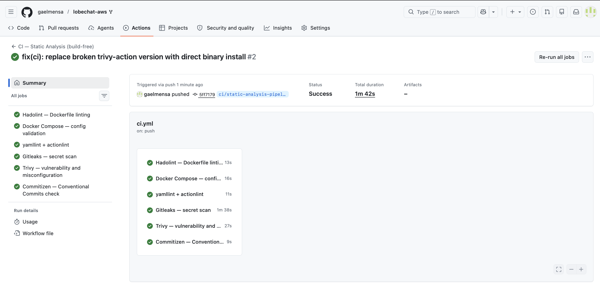

# CI Reasoning — Static Analysis Pipeline

## Evidence of GitHub Actions Run

> **Actions run URL:** _TODO: paste URL here after pushing (e.g. https://github.com/gaelmensa/lobechat-aws/actions/runs/XXXXXXXXX)_
>
> **Commit SHA the run executed against:** _TODO: paste SHA here (e.g. `git rev-parse HEAD` output)_

---

## Part A — Why what I did matters (repository-specific)

### Why the pipeline is build-free

`docker-compose.yml` declares a `vllm` service (`image: vllm/vllm-openai:latest`, line 131)
that requires an NVIDIA GPU and a 120-second health-check start period. GitHub-hosted runners
have no GPU, so `docker compose up` would hang forever and never pass. Beyond vllm, the stack
is an 8-service graph with cross-service `depends_on` health conditions — starting even the
non-GPU services would require a live Postgres, MinIO, and Casdoor to become healthy before
lobe-chat can start. None of this is feasible on a standard CI runner. The pipeline therefore
runs only static gates: schema validation, linting, and security scanning — zero containers started.

### Why `tests/` are excluded

`tests/test_vllm.py` imports `openai` and `httpx` and connects to `http://localhost:47007/v1`
(the vLLM endpoint). `tests/test_mcp_aws_resources.py` connects to a live MCPHub and makes
real AWS API calls. These are **live-stack integration tests**, not unit tests — they require
the full running stack and real credentials. They cannot run in a build-free CI environment,
so they are deliberately excluded (no `pytest` invocation anywhere in the workflow).

### Why the Compose interpolation fix is safe

`docker-compose.yml` references variables such as `${NEXT_AUTH_SECRET}`, `${AUTH_CASDOOR_ID}`,
`${KEY_VAULTS_SECRET}`, `${OPENROUTER_API_KEY}`, and `${MINIO_DOMAIN}` without defaults.
The CI job copies `.env.example` to `.env` before running `docker compose config -q`.
`.env.example` contains only non-secret placeholder strings (e.g. `change-me-nextauth-secret-32b`,
`sk-or-v1-your-openrouter-api-key`). The real `.env` — which would hold production secrets —
is listed in `.gitignore` (line 8: `.env`) and is never committed to the repository. The copy
happens only inside the ephemeral CI runner job and disappears when the job ends. No real
secrets are exposed.

---

### Gate 1 — Hadolint on `dockerfiles/mcphub.Dockerfile`

**Risk:** `dockerfiles/mcphub.Dockerfile` uses `FROM samanhappy/mcphub:latest` (line 1) — an
unpinned image tag. Every CI run may silently pull a different upstream image, making builds
non-reproducible and introducing unreviewed upstream changes. Additionally, the file sets
`USER root` (line 4) and installs `docker.io` and `gcc` (lines 5-9) into the runtime image.
Installing a full C compiler and a Docker daemon client into a production service image
massively expands the attack surface: if the running container is compromised, the attacker
has a compiler and Docker socket access to pivot further. Hadolint flags both the unpinned
`FROM` (DL3007) and the broad `apt-get install` without version pinning (DL3008).

### Gate 2 — Hadolint on `dockerfiles/sandbox.Dockerfile`

**Risk:** `dockerfiles/sandbox.Dockerfile` installs `kubectl`, `eksctl`, and `zellij` by
curling GitHub's `/releases/latest` URL at build time (lines 12-23) — no version pin, no
checksum. An attacker who compromises the upstream GitHub release or performs a DNS/MITM attack
can substitute a malicious binary that gets baked into the image with no detection. Furthermore,
line 27 grants `sandbox ALL=(ALL) NOPASSWD: ALL` — any process running as the `sandbox` user
can escalate to root without a password, turning any RCE into a full container takeover.
Hadolint flags the `latest` curl pattern (DL3047) and the absence of checksum verification.

### Gate 3 — `docker compose config -q` (schema + interpolation validation)

**Risk:** `docker-compose.yml` line 29 sets Casdoor's Postgres connection string with
`sslmode=disable`: `dataSourceName=...sslmode=disable dbname=casdoor`. LobeChat's
`DATABASE_URL` (line 45) also specifies no TLS. Secrets like `NEXT_AUTH_SECRET`,
`AUTH_CASDOOR_ID`, and `AUTH_CASDOOR_SECRET` are passed as plaintext environment variables
(lines 53-60). Validating the Compose file catches schema drift early — a malformed variable
reference or a typo in a service name would silently break the deploy without this gate.
Running `config -q` (not `up`) checks interpolation and schema without starting any container.

### Gate 4 — Trivy config mode on `dockerfiles/sandbox.Dockerfile` and `docker-compose.yml`

**Risk:** Trivy's config scanner checks Dockerfiles and Compose files against known
misconfiguration rules. In `dockerfiles/sandbox.Dockerfile` it will flag:
the missing `USER` before the final `USER sandbox` (privilege escalation window during build),
and the `NOPASSWD sudo` grant. In `docker-compose.yml` it flags:
`samanhappy/mcphub:latest` (line 102) using a mutable tag, and `vllm/vllm-openai:latest`
(line 131) same issue. It also flags that `lobe-chat` (line 37) uses
`image: lobehub/lobe-chat-database` with **no tag at all** — the most dangerous form of
floating image because any upstream push replaces the image silently.
`minio/minio:latest` (line 160) is similarly unpinned.

### Gate 5 — Gitleaks secret scan

**Risk:** The repository's `.env.example` (line 27) contains a real-looking Casdoor client
secret (`AUTH_CASDOOR_SECRET=dbf205949d704de81b0b5b3603174e23fbecc354`) and a placeholder
OpenRouter key format. More critically, `docker-compose.yml` line 123 bind-mounts
`~/.aws:/root/.aws:ro` into the `mcphub` container — meaning the deploy host's AWS credentials
are passed into the container at runtime. Gitleaks scans the full git history (enabled by
`fetch-depth: 0`) for patterns matching API keys, tokens, and private keys. The `.gitignore`
already excludes `.env`, `aws_credentials.yaml`, `*.pem`, and `config/ssh/`, so on a clean
tree gitleaks will not report committed secrets — but the scan confirms no secrets have
accidentally slipped into a commit.

### Gate 6 — Commitizen `cz check` (mirrors `.githooks/commit-msg`)

**Risk:** The repository already enforces Conventional Commits locally via
`.githooks/commit-msg`, which calls `uv run cz check --commit-msg-file`. Without the same
gate in CI, a contributor can bypass the hook (e.g. by committing with `--no-verify` or from
a GUI client) and break the automated `cz bump` / changelog workflow. The CI gate uses
`--rev-range origin/main..HEAD` rather than `--commit-msg-file` (which does not exist in CI)
and is bounded to new commits only, so pre-existing non-conventional commits in history do
not cause false failures.

---

## Part B — What is missing for a real production CI/CD (delivery) pipeline

### CI vs CD — what was built and what it stops short of

The workflow built here is **Continuous Integration**: it runs static quality and security
gates (linting, schema validation, secret scanning, misconfiguration detection) on every push
and pull request. It gives fast feedback on code quality without running anything.

It **stops short of Continuous Delivery or Deployment**. There is no build stage, no artifact
produced, no environment updated. Nothing is deployed anywhere as a result of this pipeline
passing. A production CD pipeline for this system would need to go significantly further.

---

### What a real production pipeline must add

**1. Build, push, and pin the locally-built images**

`dockerfiles/mcphub.Dockerfile` and `dockerfiles/sandbox.Dockerfile` need to be built and
pushed to a registry (e.g. Amazon ECR) with an immutable tag (e.g. the git SHA). Beyond those,
`docker-compose.yml` uses four unpinned images:
- `lobehub/lobe-chat-database` (line 37) — **no tag at all**, the most dangerous form
- `minio/minio:latest` (line 160)
- `vllm/vllm-openai:latest` (line 131)
- `samanhappy/mcphub:latest` (line 102)

All four should be resolved to immutable digests (e.g. `@sha256:...`) so every deploy is
reproducible. Today, re-deploying the same git SHA could pull a different image.

**2. Replace bind-mounted AWS credentials with GitHub OIDC federation**

`docker-compose.yml` line 123 bind-mounts `~/.aws:/root/.aws:ro` into the `mcphub` container.
`.env.example` also has commented `AWS_ACCESS_KEY_ID` / `AWS_SECRET_ACCESS_KEY` /
`AWS_SESSION_TOKEN` placeholders. This means the deploy host carries long-lived AWS credentials
as files. A real pipeline federates to AWS via GitHub OIDC
(`aws-actions/configure-aws-credentials`) so CI assumes a role with no standing key material —
the credentials are scoped to the job and expire automatically.

**3. Inject all secrets from AWS SSM Parameter Store / Secrets Manager at deploy time**

`docker-compose.yml` passes `NEXT_AUTH_SECRET`, `KEY_VAULTS_SECRET`, `AUTH_CASDOOR_ID`,
`AUTH_CASDOOR_SECRET`, `OPENROUTER_API_KEY`, and `POSTGRES_PASSWORD` as plaintext environment
variables sourced from a `.env` file on disk. A production pipeline must never store secrets
in files on the instance. Instead, a deploy step retrieves them from SSM Parameter Store or
Secrets Manager at runtime (e.g. via `aws ssm get-parameters-by-path`) and injects them into
the Compose environment — secrets are never written to disk or committed to git.

**4. Database migration stage with guarded destructive operations**

The repository ships a migration toolchain at `db/migrate` (wrapping `dbmate`) and migration
files under `db/migrations/`. A production pipeline needs an automated migration stage that
runs `db/migrate up` against the target database before deploying the new application image.
Critically, `db/migrate` also exposes a `db/seed.sql` load path and the ability to drop all
data. Any destructive database operation must be guarded behind a manual approval step in a
protected GitHub environment to prevent accidental data loss in production.

**5. Environment promotion: dev → staging → prod with manual approval gates**

There is currently no environment concept in the pipeline — a push to any branch would
theoretically deploy anywhere. A production pipeline needs named GitHub environments
(`development`, `staging`, `production`) with branch protection rules and required reviewers
on `production`. Promotion from staging to production must require a human approval, preventing
an automated push from directly touching production data and users.

**6. A real deploy mechanism to the EC2 target**

The current deploy target is a single EC2 instance (provisioned by `infra/main.tf`). The
pipeline has no deploy step. A production pipeline needs a step that:
SSHs into the instance (or uses SSM Run Command to avoid opening port 22), runs
`docker compose pull && docker compose up -d`, and keeps port 47000 closed — LobeChat should
only be reachable through the Caddy reverse proxy on 443 (as configured in the Caddyfile).
Today there is no mechanism to automate this.

**7. Post-deploy smoke tests and health gates**

Several services in `docker-compose.yml` have no `healthcheck` defined — `lobe-chat`,
`casdoor`, and `mcphub` have no health probes. A production pipeline must run post-deploy
smoke tests after the deploy step: hit the Caddy endpoint, verify a 200 from LobeChat's
login page, check `/healthz` on qdrant (line 93), and run the live-stack `tests/` (e.g.
`tests/test_vllm.py`'s `/health` check) against an **ephemeral** staging environment — not
production.

**8. Automated rollback**

Today the deploy unit is a `docker compose up` with unpinned images plus a bind-mounted
`patches/route.js` monkeypatch (line 41: `./patches/route.js:/app/...`). If a deploy breaks
production, there is no rollback mechanism. A production pipeline must detect a failed
health check after deploy and automatically roll back to the previous image digest. It should
also bake the `patches/route.js` fix into a forked, pinned image rather than mounting a
~3 MB JavaScript blob from the host filesystem.

**9. Branch protection and signed release tags**

The repository uses Commitizen's `cz bump` and `final-vX.Y.Z` tag format
(`tag_format = "v$version"` in `pyproject.toml`). Without branch protection rules on `main`,
anyone can force-push and break the tag history. A production pipeline must enforce:
required status checks (the CI jobs above must pass before merge), no direct pushes to `main`,
and signed release tags (`git tag -s`) so every production deploy is cryptographically
traceable to a known committer.

---

### Prioritisation — highest-value next step

The single highest-value next step toward real CD for this system is **replacing the
bind-mounted `~/.aws` credentials with GitHub OIDC federation** (addressing item 2 above,
`docker-compose.yml` line 123).

Every other CD item (build, deploy, migrations, rollback) requires CI to have AWS access.
Today that access is a long-lived key file sitting on the EC2 host — a single instance
compromise exposes the entire AWS account with no time limit. OIDC federation gives CI
scoped, time-limited credentials that expire after each job and require no secret management.
It unblocks all downstream pipeline steps (ECR push, SSM secret retrieval, SSM Run Command
deploy) while simultaneously closing the highest-severity standing credential risk in the
current architecture.
