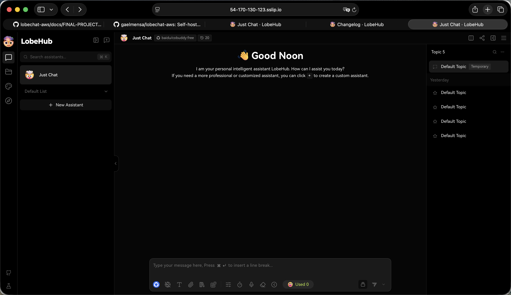

# Deployment Evidence Report

## Instance Details

| Field | Value |
|---|---|
| Region | eu-west-1 |
| Instance type | t3.xlarge (4 vCPU / 16 GB RAM) |
| EBS | 60 GB gp3 (encrypted) |
| OS | Ubuntu 24.04 LTS (AMI `ami-07dcad2e028cc44c9`, Canonical) |
| Elastic IP | 54.170.130.123 |
| EC2 instance ID | i-008048a5164ada5eb |

## Public URLs

| Service | URL |
|---|---|
| LobeChat | https://54-170-130-123.sslip.io |
| Casdoor SSO | https://casdoor.54-170-130-123.sslip.io |
| MinIO S3 | https://minio.54-170-130-123.sslip.io |

## Deployment Method

- Infrastructure provisioned with Terraform (`infra/`)
- Secrets injected via Terraform `templatefile()` into EC2 user-data at boot — never in git
- Docker Compose stack started automatically on first boot via user-data script
- Caddy reverse proxy handles automatic TLS via Let's Encrypt (HTTP-01 / TLS-ALPN-01)
- DNS via sslip.io — `54-170-130-123.sslip.io` resolves to EIP `54.170.130.123`
- EC2 port 47000 absent from security group — direct access is blocked (confirmed with `curl` timeout)

## Terraform Outputs

```
ec2_public_ip = "54.170.130.123"
lobechat_url  = "https://54-170-130-123.sslip.io"
casdoor_url   = "https://casdoor.54-170-130-123.sslip.io"
minio_url     = "https://minio.54-170-130-123.sslip.io"
ssh_command   = "ssh ubuntu@54.170.130.123"
```

## Stack Health Check

All 7 services running as of 2026-05-27 10:31 UTC:

```
NAME              STATUS
caddy             Up 24 minutes
casdoor           Up 24 minutes
lobe-chat         Up 24 minutes
mcphub            Up 24 minutes
minio             Up 24 minutes (healthy)
qdrant            Up 24 minutes
shared-postgres   Up 24 minutes (healthy)
```

## Screenshot Evidence

### 1. LobeChat accessible over HTTPS



LobeChat chat interface loaded at `https://54-170-130-123.sslip.io`. URL bar shows HTTPS with valid certificate indicator.

---

### 2. Valid TLS Certificate Chain


Certificate details:
- **Domain:** 54-170-130-123.sslip.io
- **Issued by:** E8 (Let's Encrypt)
- **Chain:** ISRG Root X1 → E8 → 54-170-130-123.sslip.io
- **Expires:** 24 August 2026
- **Status:** This certificate is valid ✅

---

### 3. AI Chat Response (Streaming)


Successful AI chat response using `baidu/cobuddy:free` model via OpenRouter. User asked about a DevOps Management course — model responded with structured output. Token counter shows 1,342 tokens used, confirming live inference through the OpenRouter API.

---

### 4. Casdoor SSO Login Page


Casdoor identity provider accessible at `https://casdoor.54-170-130-123.sslip.io` over HTTPS. Login completed successfully with `lobechat/user` credentials, OAuth2 callback to LobeChat executed without errors.

---

### 5. Port 47000 Blocked

```bash
$ curl -v --max-time 5 http://54.170.130.123:47000
*   Trying 54.170.130.123:47000...
* Connection timed out after 5006 milliseconds
curl: (28) Connection timed out after 5006 milliseconds
```

Direct access to LobeChat on port 47000 times out — security group only allows ports 22 (admin IP), 80 (ACME challenge), and 443 (HTTPS).

## Timestamp

Deployment completed: 2026-05-27 10:07 UTC
