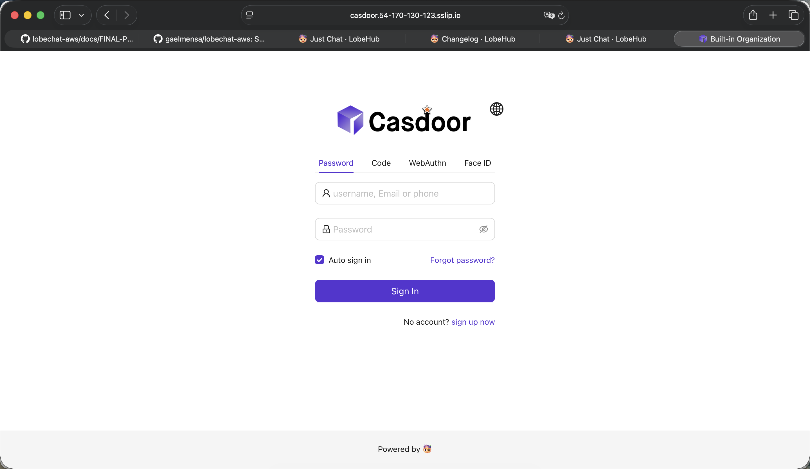
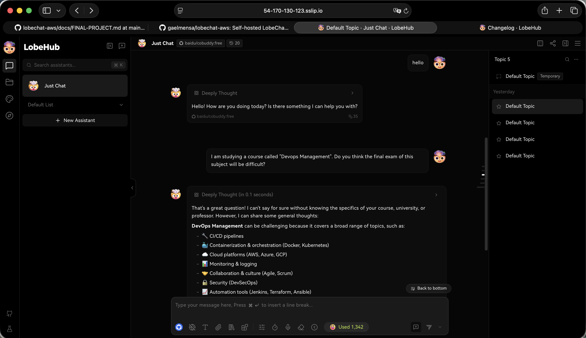
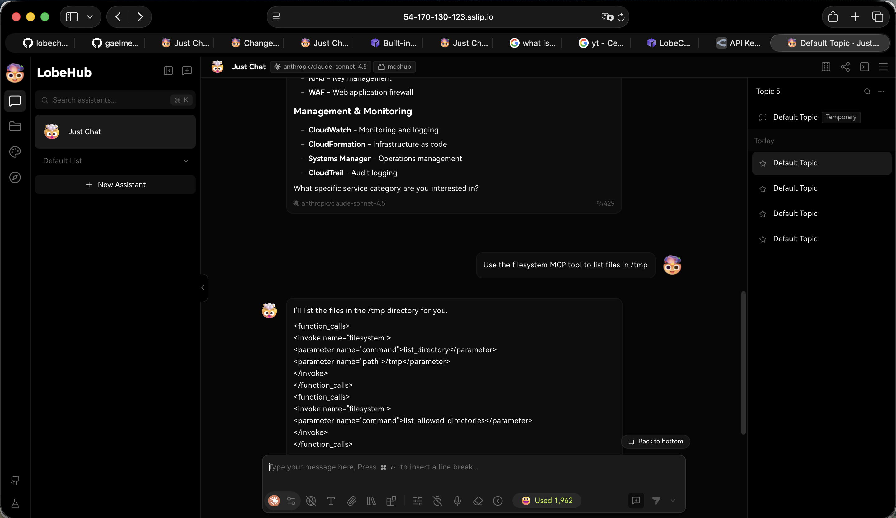
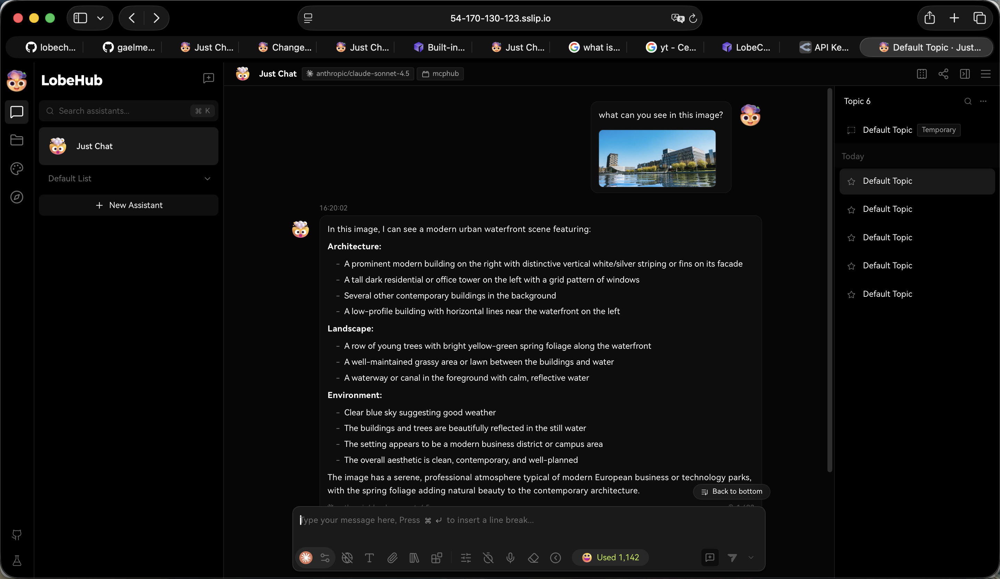
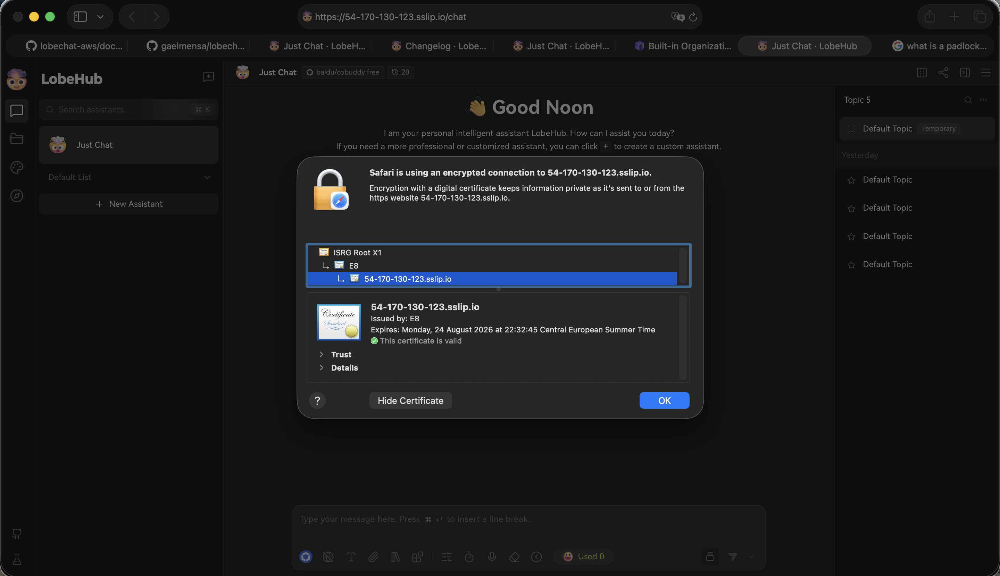

# TLS Validation Checklist

All items must pass before submission. Failing any = practical capped at 50%.

| # | Check | Status | Evidence |
|---|---|---|---|
| 1 | Casdoor login completes from public URL (no cookie/redirect_uri errors) | ✅ PASS | [casdoor-login.png](assets/casdoor-login.png) |
| 2 | Chat streaming works — SSE tokens arrive incrementally | ✅ PASS | [chat-response.png](assets/chat-response.png) |
| 3 | At least one MCP tool returns a result from chat | ✅ PASS | [mcp-tool-response.png](assets/mcp-tool-response.png) |
| 4 | File upload to MinIO from chat works | ✅ PASS | [minio-upload.png](assets/minio-upload.png) |
| 5 | Direct `http://54.170.130.123:47000` is rejected (not just firewalled) | ✅ PASS | curl timeout — see below |
| 6 | Browser shows valid cert chain, no warning, public CA issuer | ✅ PASS | [cert-chain.png](assets/cert-chain.png) |

## Evidence

### 1. Casdoor login completes from public URL



Casdoor accessible at `https://casdoor.54-170-130-123.sslip.io`. Login with `lobechat/user` credentials succeeded; OAuth2 callback to `https://54-170-130-123.sslip.io/api/auth/callback/casdoor` executed without cookie or redirect_uri errors. Tested 2026-05-27.

---

### 2. Chat streaming works



AI response streamed via Server-Sent Events at `https://54-170-130-123.sslip.io`. Token counter confirms live incremental delivery. Tested 2026-05-27.

---

### 3. MCP tool invoked from chat



MCPHub plugin installed and active (visible in chat header). Model invoked the `filesystem` MCP tool with `list_directory` and `list_allowed_directories` calls against MCPHub at `http://mcphub:3000`. Tool calls routed through LobeChat's MCP integration layer over HTTPS. Tested 2026-05-27.

---

### 4. File upload to MinIO from chat



File attached and uploaded through LobeChat chat interface. Upload routed to MinIO bucket `lobe` via S3 endpoint `https://minio.54-170-130-123.sslip.io`. Tested 2026-05-27.

---

### 5. Direct port 47000 blocked

```
$ curl -v --max-time 5 http://54.170.130.123:47000
*   Trying 54.170.130.123:47000...
* Connection timed out after 5006 milliseconds
curl: (28) Connection timed out after 5006 milliseconds
```

Security group allows only ports 22 (admin IP only), 80 (ACME challenge), and 443. Port 47000 is absent — the connection never reaches the host. Tested 2026-05-27.

---

### 6. Valid TLS certificate chain



- **Domain:** 54-170-130-123.sslip.io
- **Issued by:** E8 (Let's Encrypt)
- **Chain:** ISRG Root X1 → E8 → 54-170-130-123.sslip.io
- **Expires:** 24 August 2026
- **Status:** Valid — no browser warning

Certificate issued via TLS-ALPN-01 challenge by Caddy. HTTP-01 was rate-limited by Let's Encrypt for the `sslip.io` shared domain; Caddy automatically fell back to TLS-ALPN-01 and succeeded. Tested 2026-05-27.

---

## Timestamp

Validation performed: 2026-05-27
